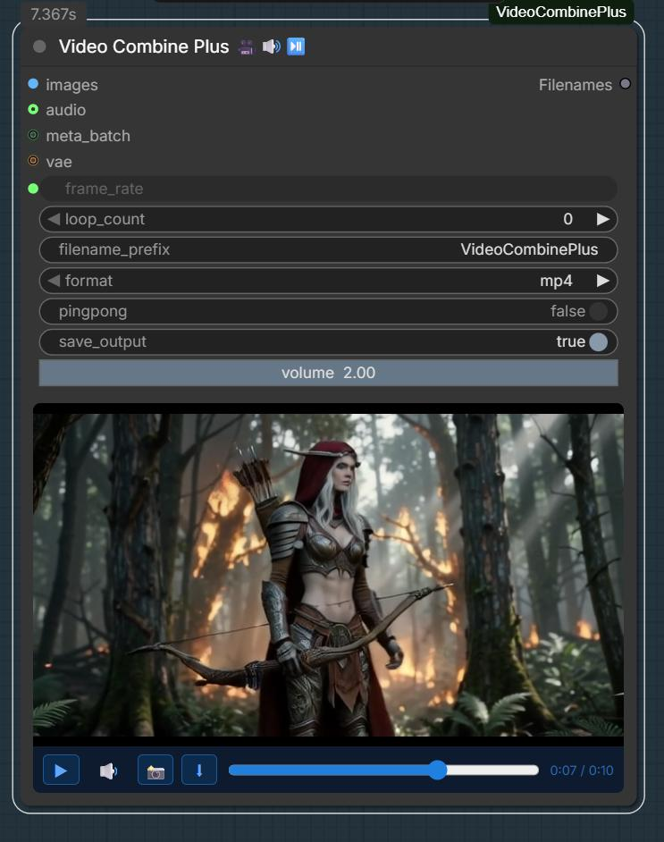

# Video Combine Plus for ComfyUI

Node Similar to the original videocombine but where I add some adittional features:

- Control the sound volume,
- Video timeline,
- Save current frame to image.

Documentation is mostly in the node descriptions and tooltips.

# Installation
1. Clone this repo into `custom_nodes` folder.
2. Restart ComfyUI

 

 
